# 📈 Week 2 — Machine Learning for Regression

My work for [Module 2 of ML Zoomcamp](https://github.com/DataTalksClub/machine-learning-zoomcamp/tree/main/02-regression). I built a linear regression model **from scratch in NumPy**, taking it from a raw CSV to a tuned, regularized model evaluated on a held-out test set.

← [Back to course overview](../README.md)

---

## 📂 What's in this folder

| File | What it is |
|---|---|
| `Week2_Practice.ipynb` | End-to-end practice pipeline written from scratch: data prep, splitting, feature engineering, regularized linear regression, and tuning |
| `HW2_final.ipynb` | Homework 2 on the car fuel efficiency dataset (`car_fuel_efficiency_2026.csv`) |

<!-- Add any other files (backups, scripts) here -->

**Datasets:** car prices (lecture codelab), car fuel efficiency (homework)

---

## 🗺️ The Pipeline at a Glance

```mermaid
flowchart LR
    A["Load and clean"] --> B["EDA: check target distribution"]
    B --> C["Split 60/20/20 with a fixed seed"]
    C --> D["Fill missing values using train stats only"]
    D --> E["Feature engineering in prepare_X"]
    E --> F["Train: normal equation + regularization r"]
    F --> G["Tune r on validation RMSE"]
    G --> H["Retrain on train + val"]
    H --> I["Evaluate once on test"]
```



---

## 🧠 Core Concepts

### 1. Linear regression is an overdetermined system

Each row of data gives one equation sharing the same unknown weights. With far more rows than weights, no single set of weights satisfies every equation, so we look for the weights that minimize the total squared error. The **normal equation** solves this in closed form:

$$w = (X^T X)^{-1} X^T y$$

### 2. The bias term

Adding a **column of ones** to `X` lets the model learn an intercept `w₀` alongside the feature weights. `w₀` is the baseline prediction before any feature contributes. In ordinary least squares, the fitted model passes through the means of the data.

### 3. Trace the shapes

| Step | Shape |
|---|---|
| Feature matrix `X` | `(n, d)` |
| After adding the bias column | `(n, d+1)` |
| `X.T @ X` | `(d+1, d+1)` |
| Weights `w` | `(d+1,)` |

`XᵀX` should always be small and square (features × features). If you get an `n × n` matrix, the multiplication order is flipped. Also, `XᵀX` is **not** an identity matrix; only `XᵀX @ inv(XᵀX)` is.

### 4. `@` vs `*`

`@` is matrix multiplication. `*` is element-wise and raises a `ValueError` when shapes don't line up. Prefer `@` over `.dot()` because it reads like the math.

### 5. Long-tailed targets and the log transform

Targets like price are often right-skewed, with a few very large values. Check with a histogram and `.skew()`. `np.log1p` compresses the long tail so a few extreme values don't dominate training, and `np.expm1` converts predictions back.

I keep **two sets of targets**:
- **Log-transformed** (`y_train`, `y_val`, `y_test`) for training
- **Original** (`y_train_orig`, …) for evaluating in real, interpretable units

### 6. Reproducible train / validation / test split (60/20/20)

1. Compute the sizes: `n_val` and `n_test` as 20% each, then `n_train = n - n_val - n_test` so rounding leftovers go to training.
2. Build `idx = np.arange(n)`, set `np.random.seed(...)`, then shuffle `idx`.
3. Slice with `.iloc[idx[...]]`. `.iloc` selects by **position**, so shuffled positions map to rows regardless of the index labels.
4. Index labels carry over from the original DataFrame. `reset_index(drop=True)` gives each split a clean `0..n` index if needed.

A fixed seed means the same rows land in the same split on every run.

### 7. Missing values without data leakage

I compared two strategies for missing `horsepower`: **fill with 0** and **fill with the mean**.

The mean must be computed from the **training set only** and then applied to train, validation, **and** test. Validation and test stand in for unseen future data, so no information from them can be used to prepare features.

### 8. One-hot encoding

For each category value, `(df[col] == value).astype(int)` produces a 0/1 column, named with an f-string like `f"{col}_{value}"`. To scale this to many categorical columns, use a dictionary of `{column: [values]}` and loop over it.

**Sanity check:** for any one categorical column, each row's one-hot columns should sum to exactly 1.

### 9. The dummy variable trap

If you include **all** categories of a column *plus* the bias column, the one-hot columns sum to 1 in every row, which is identical to the bias column. That perfect collinearity makes `XᵀX` **singular**, so it can't be inverted.

Fixes:
- Drop one category; it becomes the baseline that `w₀` represents.
- Regularization (below) also keeps the matrix invertible.

### 10. `prepare_X`: one function for every split

Every split must go through **exactly the same transformations**, so they live in one function.

- Start with `df = df.copy()`. Python passes DataFrames by reference, so without the copy the function silently modifies the caller's data. (Analogy: sharing a Google Docs link vs. making a copy.)
- Use only the function's `df` parameter inside the body, never a global like `df_train`.

### 11. Regularization

**Intuition:** when features overlap or are highly correlated, the model can produce huge weights that cancel each other out. These fit training data but swing wildly on validation data. Adding a small value `r` to the diagonal of `XᵀX` penalizes large weights and keeps the matrix invertible:

$$w = (X^T X + rI)^{-1} X^T y$$

### 12. RMSE

$$\text{RMSE} = \sqrt{\frac{1}{n}\sum (\hat{y} - y)^2}$$

RMSE is in the units of the target. If the target was log-transformed, convert predictions back with `expm1` before reporting in real units, and always compare models on the same scale.

### 13. Model selection workflow

1. Loop over candidate `r` values: train on **train**, score RMSE on **validation**.
2. Pick the best `r`.
3. Concatenate **train + validation** and retrain with that `r`.
4. Evaluate **once** on **test**.

**Result from my practice pipeline:** best `r = 1.0`, validation RMSE ≈ **2.21**, test RMSE ≈ **2.32**. Test is close to validation, which suggests the model generalizes and tuning didn't overfit the validation set.

---

## ⚠️ Pitfalls I Hit (and How I Fixed Them)

### Data and leakage

| Pitfall | Symptom | Fix |
|---|---|---|
| Computed the fill mean **before** splitting | No error; scores are silently optimistic | Compute the mean from the training set only |
| Applied the fill value to train and val but **not test** | NaNs or inconsistent features in test | Apply the same training mean to all three splits |
| Wrong column filter from `df.dtypes` | Got dtypes back instead of column names | `df.dtypes[df.dtypes == 'object'].index` returns the names |
| `curl -O` saved a different filename than `pd.read_csv` expected | `FileNotFoundError` | Run `ls` to confirm the saved filename |

### pandas and NumPy behavior

| Pitfall | Symptom | Fix |
|---|---|---|
| `np.random.shuffle` works **in place** | Assigning its result gives `None` | Call it on its own line, then use the shuffled array |
| Assigning new columns to a slice | `SettingWithCopyWarning` | `.copy()` the slice first |
| Function modified its input DataFrame | Original DataFrame gained new columns | `df = df.copy()` at the top of the function |
| Used `*` for matrix math | `ValueError` on shapes | Use `@` |

### Function bugs in `prepare_X`

| Pitfall | Symptom | Fix |
|---|---|---|
| Used `df_train` inside the function instead of the `df` parameter | Val/test features silently built from training rows | Use only the parameter inside the body |
| Name mismatches (`c` vs `col`, `categories` vs `categorical`) | `NameError` | Read every variable name in the function and confirm it belongs there |
| `features` was a string or undefined before `.append()` | `AttributeError` / `NameError` | Initialize `features = []` first |
| Computed `max_year` from the wrong DataFrame | Derived features inconsistent across splits | Check the source of every reference value used inside the function |

### Modeling

| Pitfall | Symptom | Fix |
|---|---|---|
| Included all one-hot columns + bias | Singular matrix error | Drop one category, or add regularization |
| Sanity check `(XTX @ XTX_inv).round()` inside a function | Result silently discarded, nothing shown | `print(...)` it or `assert np.allclose(...)` |

### Notebook and Git workflow

| Pitfall | Symptom | Fix |
|---|---|---|
| Stale notebook state | Results depend on cell run order | **Restart kernel → Run All** before trusting results |
| Notebook not saved to disk in Codespaces | Git pushed an old version / "nothing to commit" | Save (Cmd/Ctrl+S) before `git add`; `%history -f <file>.py` can rescue code from the running kernel |

---

## 💡 Key Learnings and Habits

- **Print `.shape` after every transformation.** Most bugs show up as a wrong shape first.
- **Fix the random seed** so splits and results are reproducible.
- **Fit on train, apply everywhere.** Any statistic (means, fill values, reference years) comes from training data only.
- **Touch the test set exactly once**, at the very end.
- **Write sanity checks that actually report**, using `print` or `assert`, not bare expressions inside functions.
- **One function, every split.** `prepare_X` guarantees train, val, and test get identical treatment.
- **Restart and Run All** before trusting numbers or committing.
- **Save before you commit.** In Codespaces, an unsaved tab means Git sees the old file.

---

## 📐 Quick Reference

```python
# Regularized linear regression via the normal equation
def train_linear_regression_reg(X, y, r=0.0):
    ones = np.ones(X.shape[0])
    X = np.column_stack([ones, X])             # add bias column
    XTX = X.T @ X + r * np.eye(X.shape[1])     # regularize the diagonal
    w = np.linalg.inv(XTX) @ X.T @ y
    return w[0], w[1:]                         # bias, feature weights

def rmse(y, y_pred):
    return np.sqrt(np.mean((y_pred - y) ** 2))
```

---

## 🔗 Resources

- [Module 2 course materials](https://github.com/DataTalksClub/machine-learning-zoomcamp/tree/main/02-regression)
- [Lecture playlist](https://www.youtube.com/playlist?list=PL3MmuxUbc_hIhxl5Ji8t4O6lPAOpHaCLR)
- [Course FAQ](https://datatalks.club/faq/machine-learning-zoomcamp.html)