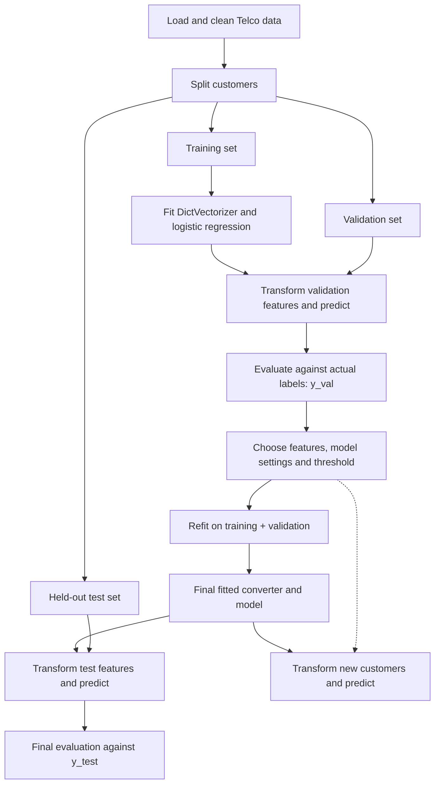
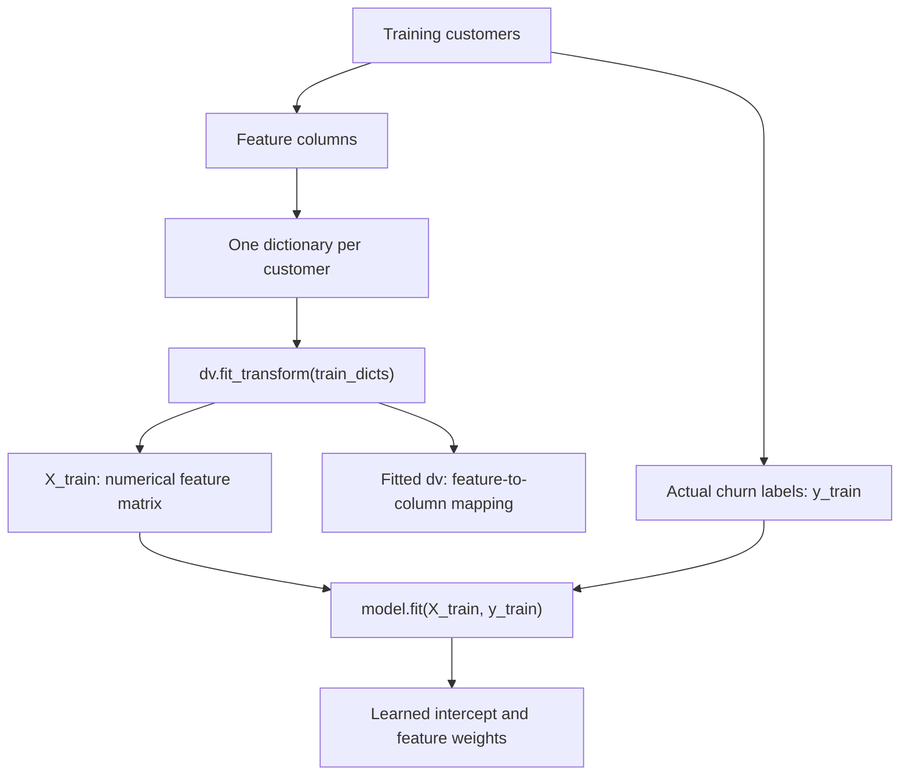
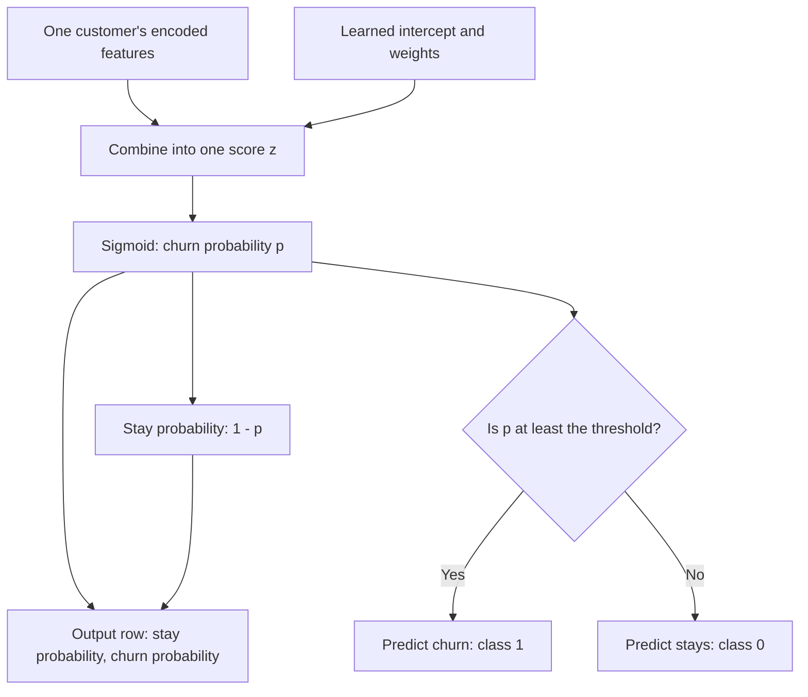

# Logistic Regression — Telco Customer Churn Workflow

**Goal:** use customer features to estimate the probability of churn.

- **Features:** tenure, monthly charges, contract type, etc.
- **Target:** `0 = stays`, `1 = churns`.
- **Output:** churn probability, followed by an optional class decision.

## 1. End-to-end process



The dotted arrow carries the selected threshold into future decisions.

| Dataset | Purpose |
|---|---|
| Training | Learn the encoding and model weights |
| Validation | Compare choices and select a threshold |
| Test | Check final performance after choices are fixed |

## 2. Training: where the target is used



### Two different learning steps

| Operation | What it learns |
|---|---|
| `dv.fit_transform(train_dicts)` | Which features/categories belong in which numerical columns |
| `model.fit(X_train, y_train)` | Weights and intercept that relate the features to churn |

**Keep `churn` separate from the feature dictionaries.**

One-hot encoding turns categories into indicator columns. For example:

| Contract | contract=month-to-month | contract=two_year |
|---|---:|---:|
| month-to-month | 1 | 0 |
| two_year | 0 | 1 |

Numerical features retain their values.

## 3. Prediction: many features become two probabilities



### Calculate the weighted score

$$
z = b + \sum_{j=1}^{m} w_jx_j
$$

### Calculate churn probability

$$
P(y=1\mid\mathbf{x}) = p = \frac{1}{1+e^{-z}}
$$

### Calculate stay probability

$$
P(y=0\mid\mathbf{x}) = 1-p
$$

With class order `[0, 1]`, a customer's output could be:

```python
[0.289, 0.711]
```

This means **28.9% probability of staying** and **71.1% probability of churn**.

**Input columns describe features. Output columns describe outcomes.**

## 4. Connect the diagram to the code

```python
# TRAIN: learn the encoding and model weights.
X_train = dv.fit_transform(train_dicts)
model.fit(X_train, y_train)

# VALIDATE: reuse the fitted encoding.
X_val = dv.transform(val_dicts)

# Predict both outcome probabilities.
probabilities = model.predict_proba(X_val)

# Keep churn probabilities: all rows, second column.
p_val = probabilities[:, 1]

# Convert probabilities into decisions.
churn_decision = (p_val >= 0.50)
```

This assumes `dv`, `model`, the dictionaries, and `y_train` have already been created.

## 5. Evaluate and finish

- Compare **probabilities** with actual labels using log loss or ROC AUC.
- Compare **class decisions** with actual labels using accuracy, precision, or recall.
- Choose settings and a threshold using validation results.
- Refit the chosen approach on training plus validation data.
- Evaluate on the held-out test set.
- Use the final converter and model for future customers.

**Actual targets are used during training and evaluation. Prediction uses customer features and learned weights.**

> These diagrams use Mermaid. Rendering requires a Markdown viewer with Mermaid support; Jupyter support depends on your setup.